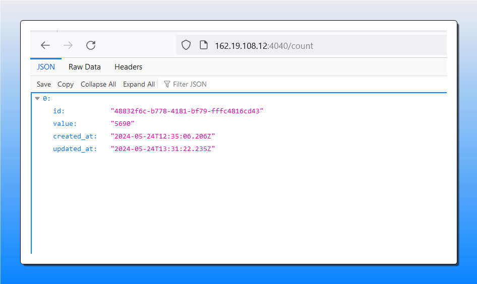

Projet Kubernetes - Evaluation 

# Introduction

J'ai commencé par ses étapes : 
- Configurer KubeConfig
- Préparation des images docker pour le sender,reciver, postgres et les pousser dans registry hub 
- Construire les fichiers de déploiements pour les service backend (sender/reciver)
- Construire le fichier de déploiements pour la base de donnée Postgres
- Construire le fichiers de déploiements pour rabbitMq
- Construire les fichiers de Job pour créer la base de données et la migration
- Construire un fichier de HPA auto scaling pour le service reciver

# Expliquation des service sender et reciver

Sender Service:
    Service responsable d'envoyer des messages à RabbitMQ.
    Connecté à RabbitMQ pour l'envoi de messages.
    Configuré avec un intervalle d'envoi défini.

Reciver Service:
    Service responsable de récupérer des messages depuis RabbitMQ.
    Connecté à RabbitMQ pour la récupération de messages.
    Connecté à la base de données PostgreSQL pour enregistrer les données reçues.
    Configuré pour écouter RabbitMQ.

## Configuration de l'Application

### Sender Service:

    RABBITMQ_URL: URL de RabbitMQ.
    QUEUE: Nom de la file d'attente RabbitMQ.
    INTERVAL: Intervalle d'envoi des messages.
    DATABASE_POSTGRES: Paramètres de connexion à la base de données PostgreSQL.

### Reciver Service:

    RABBITMQ_URL: URL de RabbitMQ.
    QUEUE: Nom de la file d'attente RabbitMQ.
    DATABASE_POSGTRES: Paramètres de connexion à la base de données PostgreSQL.

## Pods 
Voici mes pods 

## Configuration du HPA (Horizontal Pod Autoscaler)

### Un HPA a été configuré pour le service Reciver afin de mettre à l'échelle automatiquement les pods en fonction de l'utilisation CPU.
    Min Replicas: 1
    Max Replicas: 10
    Target CPU Utilization: 10%

## Vérification:
- Je me suis assuré que tous les pods sont en cours d'executions. 
- Je me suis assuré que les deux services se communiquent bien à travers Rabbitmq
- Je me suis assuré que les service reciver est bien connecté à la base Postgres

Assurez-vous que tous les pods sont en cours d'exécution en utilisant la commande kubectl get pods -n mustafa-ismail.

